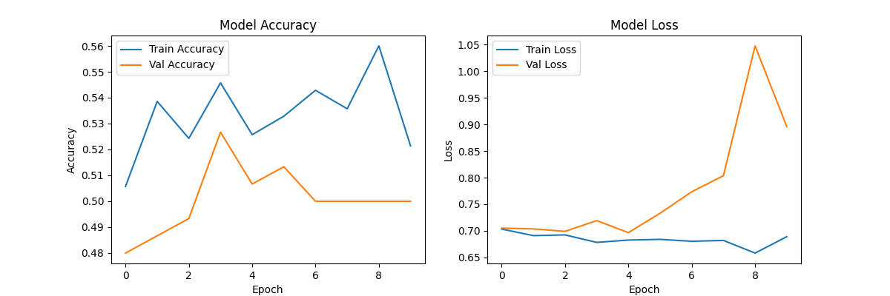

```markdown
# Deepfake Detection Tool

A deep learning-based tool for detecting deepfake images using a pre-trained Xception model. The tool includes scripts for training a model and predicting whether an image is real or fake.

## Features
- Train a deepfake detection model using a dataset of real and fake images.
- Predict whether a given image is a deepfake or original.
- Visualize training history and predictions.
- Uses data augmentation for robust training.

## Requirements
- Python 3.8+
- TensorFlow
- OpenCV
- NumPy
- Scikit-learn
- Matplotlib
- Seaborn

## Installation
1. Clone the repository:
   ```bash
   git clone https://github.com/ishakxdev/deepfake-detection.git
   cd deepfake-detection
   ```
2. Install dependencies:
   ```bash
   pip install -r requirements.txt
   ```

## Dataset Structure
Organize your dataset in the following structure:
```
data/
├── deepfake/
│   ├── deepfake1.jpg
│   ├── deepfake2.jpg
│   └── ...
├── original/
│   ├── original1.jpg
│   ├── original2.jpg
│   └── ...
```

## Usage

### Training the Model
Run the training script to build and train the model:
```bash
python tr.py --train
```
This will:
- Load images from the `data/` directory.
- Train the model and save it as `deepfake_detector.h5`.
- Generate training history plot (`training_history.png`) and prediction visualizations (`predictions.png`).

### Predicting on a Single Image
Use the test script to classify an image:
```bash
python test_model.py --image path/to/image.jpg
```
Output will indicate whether the image is "Deepfake" or "Original" with a confidence score.

## Training History
Below is an example of the training history plot showing accuracy and loss over epochs:



## Model Details
- **Architecture**: Xception with fine-tuned layers.
- **Input Size**: 299x299 pixels.
- **Output**: Binary classification (Deepfake = 1, Original = 0).
- **Optimizer**: Adam (learning rate = 1e-4).
- **Loss**: Binary Crossentropy.
- **Metrics**: Accuracy, F1-Score, ROC-AUC.

## Logs
Training logs are saved in the `logs/` directory and can be visualized using TensorBoard:
```bash
tensorboard --logdir logs/
```

## Contact
- Instagram: [ishakdev](https://www.instagram.com/ishakdev)
- Twitter: [ishakxdev](https://twitter.com/ishakxdev)
- Telegram: [ishakxdev](https://t.me/ishakxdev)

## License
MIT License
